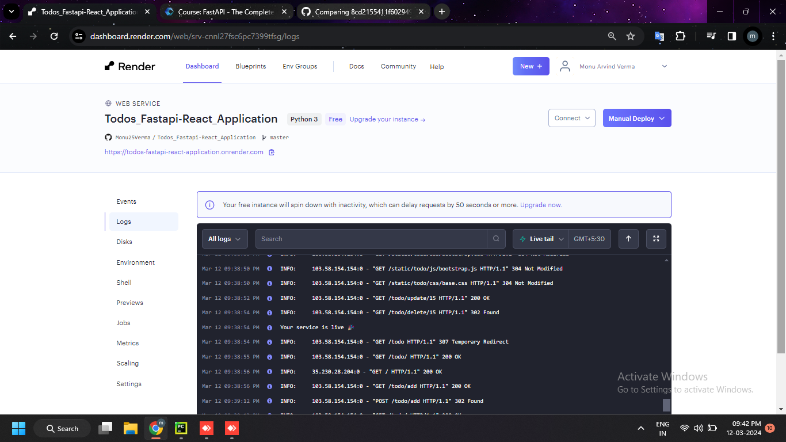
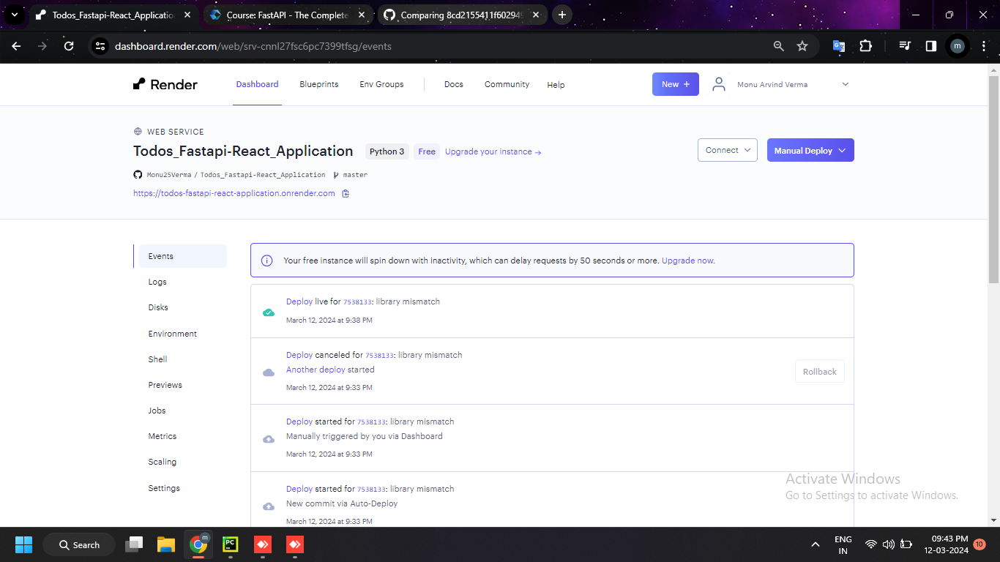
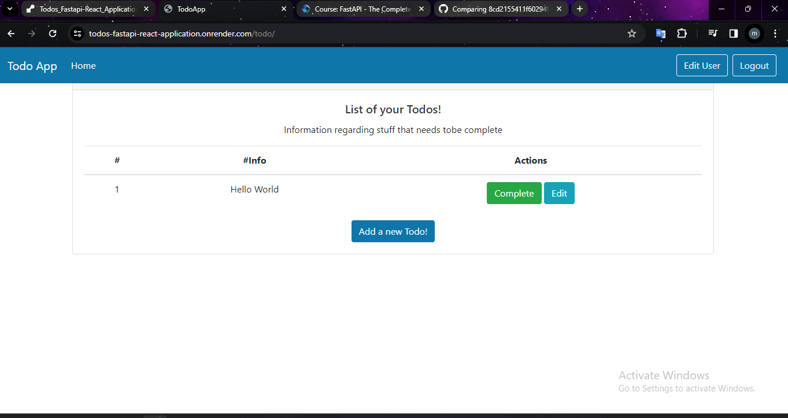

# Todo App API

Welcome to the Todos App API! This API helps you perform various tasks related to user authentication, managing to-do lists, and user administration.

Developed by: [Monu Verma](https://www.linkedin.com/in/monu-verma-8738831b9) | [GitHub](https://github.com/Monu25Verma)

## Installation

1. Clone this repository to your local machine.
2. Install the required dependencies using `pip install -r requirements.txt`.
3. Run the FastAPI server using `uvicorn main:app --reload` or rum the main.py file

## Endpoints

### Authentication
- `GET /auth/`: Authentication Page
- `POST /auth/user`: Create User
- `POST /auth/token`: Login For Access Token
- `POST /auth/`: Login
- `GET /auth/register`: Register Page
- `POST /auth/register`: Register User
- `GET /auth/logout`: Logout

### To-Do List
- `GET /todo/`: Read All Todo
- `GET /todo/add`: Add Todo Page
- `POST /todo/add`: Create Todo
- `GET /todo/update/{todo_id}`: Update Todo Page
- `POST /todo/update/{todo_id}`: Update Todo
- `GET /todo/delete/{todo_id}`: Delete Todo
- `GET /todo/complete/{todo_id}`: Complete Todo

### Admin
- `GET /admin/todo`: Read All Todos (admin only)
- `DELETE /admin/todo/{todo_id}`: Delete Todo (admin only)

### User Management
- `GET /user`: Get All User Info
- `PUT /user/change_pass`: Change Password
- `PUT /user/update_phoneNo/{phone_number}`: Update Phone Number

## Deployment

This project was been deployed using render.com and ran on a live server (https://todos-fastapi-react-application.onrender.com).

## Output Images
Here are some output images from the live deployment:

- 
- 
- 

